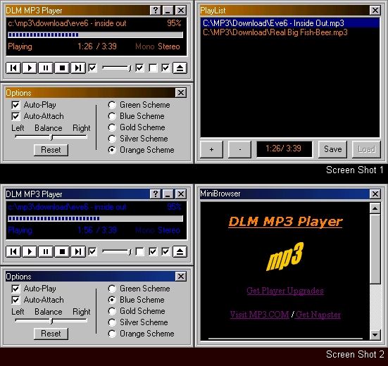



## DLM MP3 Player

### Description

***RE-UPDATED (Fixed a stup*d error when song finished playing and there was no files in the playlist)*** Fully functionnal MP3 Player with multiple color schemes, Volume control, balance control, position control, basic controls (play-stop-etc), Auto-Play and Repeat functions. Includes MiniBrowser and streaming capabalities. Now includes the awaited Playlist window with Save and load capabilities...  .
 
### More Info
 
All inputs are mannaged by INIs

except for the MP3 FileName and Infos

The coding is kind of messy... Haven't had the time to simplify and clean it up! (Sorry!)

Bug in the MiniBrowser window... must be opened twice for it to show correctly ..

             |
---                |---
**Submitted On**   |2000-09-02 13:06:46
**By**             |[Philippe Lamalice](https://github.com/Planet-Source-Code/PSCIndex/blob/master/ByAuthor/philippe-lamalice.md)
**Level**          |Intermediate
**User Rating**    |4.0 (20 globes from 5 users)
**Compatibility**  |VB 6\.0
**Category**       |[Sound/MP3](https://github.com/Planet-Source-Code/PSCIndex/blob/master/ByCategory/sound-mp3__1-45.md)
**World**          |[Visual Basic](https://github.com/Planet-Source-Code/PSCIndex/blob/master/ByWorld/visual-basic.md)
**Archive File**   |[CODE\_UPLOAD9580932000\.zip](https://github.com/Planet-Source-Code/philippe-lamalice-dlm-mp3-player__1-11117/archive/master.zip)

